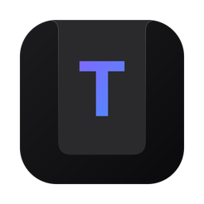
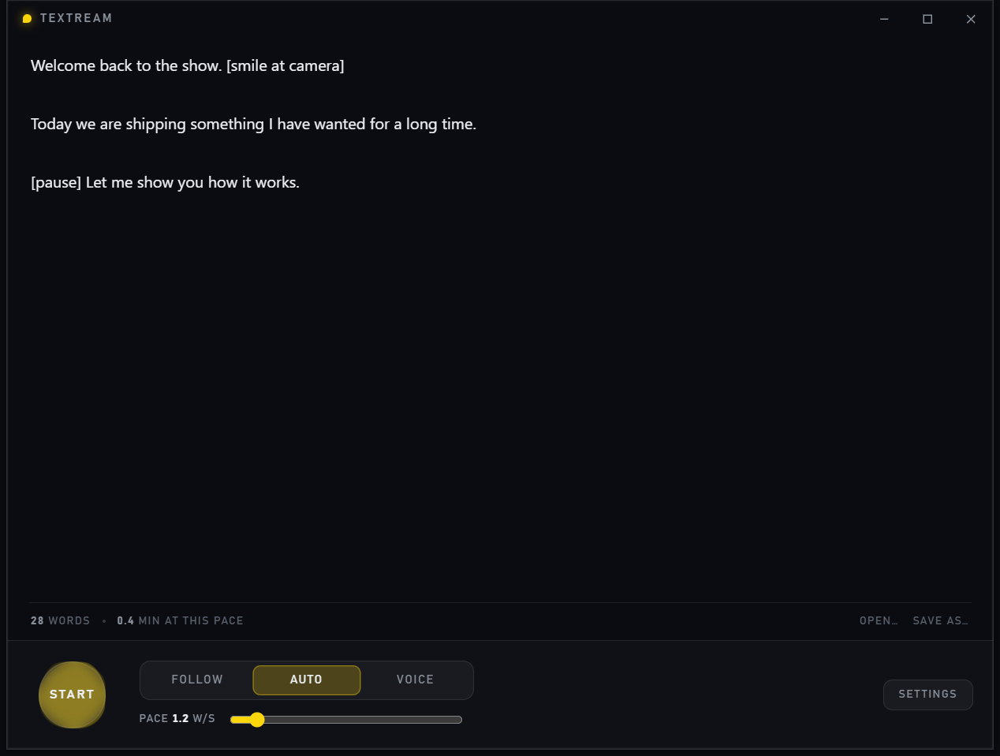
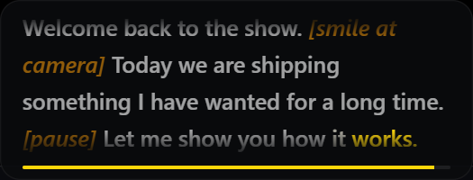

<p align="center">
  
</p>

<h1 align="center">Textream for Windows</h1>

<p align="center">
  <strong>A free Windows teleprompter with real-time word tracking, classic auto-scroll, and voice-activated scrolling.</strong>
</p>

<p align="center">
  Windows port of <a href="https://github.com/f/textream"><strong>Textream</strong></a>
</p>

<p align="center">
  <a href="https://github.com/CRTkafa/textream-windows/releases/latest"><strong>Download the latest release</strong></a>
</p>

<p align="center">
  
</p>

<p align="center">
  
</p>

## Features

- **Word Tracking** — follows your speech and advances through the script in real time
- **Classic** — steady automatic scrolling without a microphone
- **Voice-Activated** — scrolls while you are speaking and pauses when you stop
- Fully **on-device** speech recognition
- Global shortcuts for hands-free control
- Click-through, always-on-top prompter overlay
- Hidden from supported screen capture APIs
- `.textream` file compatibility with the macOS app
- Persistent settings and script autosave
- System tray support

## Languages

Word Tracking currently supports downloadable models for:

**English, German, French, Spanish, Mandarin Chinese, Arabic, Indonesian, Japanese, Russian, Thai, and Vietnamese.**

Turkish is not available yet because a compatible streaming sherpa-onnx model is not currently available.

## About this port

The original [Textream](https://github.com/f/textream) is a macOS app by [Fatih Kadir Akın](https://fka.dev), from an original idea by [Semih Kışlar](https://x.com/semihdev).

This is a separate Windows implementation rather than a fork because the original app is built around SwiftUI, AppKit, and Apple speech APIs. The Windows port reimplements the relevant product behavior in Rust, Tauri, and Svelte.

On macOS, use the original app.

For architecture, implementation notes, build details, roadmap, and Windows-specific behavior, see [docs/DEVELOPMENT.md](docs/DEVELOPMENT.md).

## Building

Requirements: Rust with the MSVC toolchain, Bun, WebView2, LLVM, and Visual Studio C++ build tools.

```bash
bun install
bun run app
```

Build the installer:

```bash
bun run app:build
```

Run tests:

```bash
cargo test --workspace
```

More build notes are in [docs/DEVELOPMENT.md](docs/DEVELOPMENT.md#building).

## Credits

- Original Textream: [Fatih Kadir Akın](https://fka.dev)
- Original idea: [Semih Kışlar](https://x.com/semihdev)
- Windows port: [CRTkafa](https://github.com/CRTkafa)
- Speech recognition: [sherpa-onnx](https://github.com/k2-fsa/sherpa-onnx)
- Typeface: [OpenDyslexic](https://opendyslexic.org)

## License

MIT, matching the original. See [LICENSE](LICENSE).
